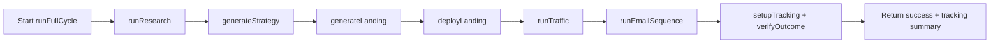
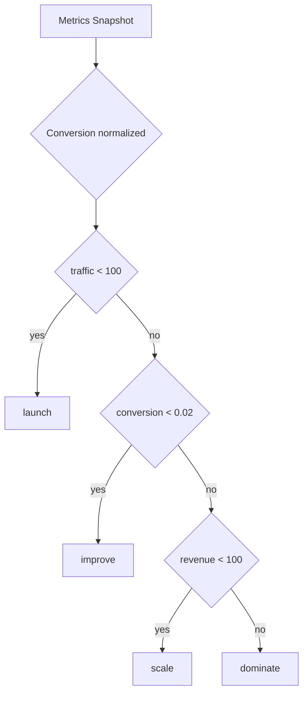
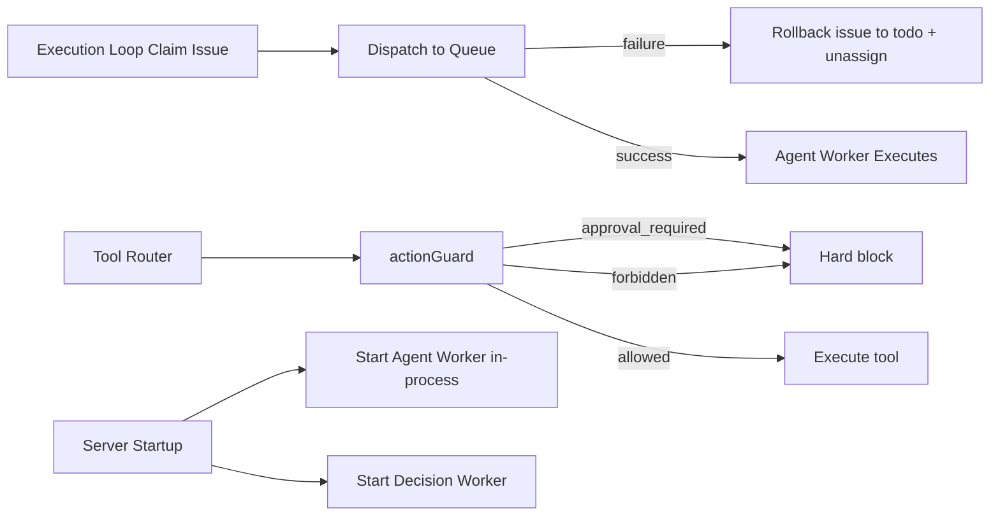
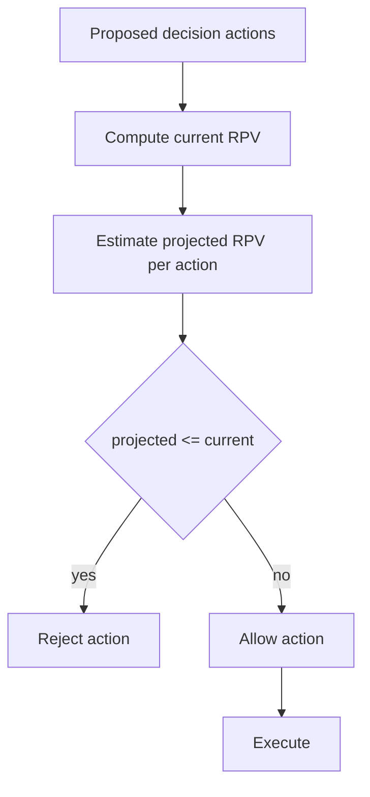
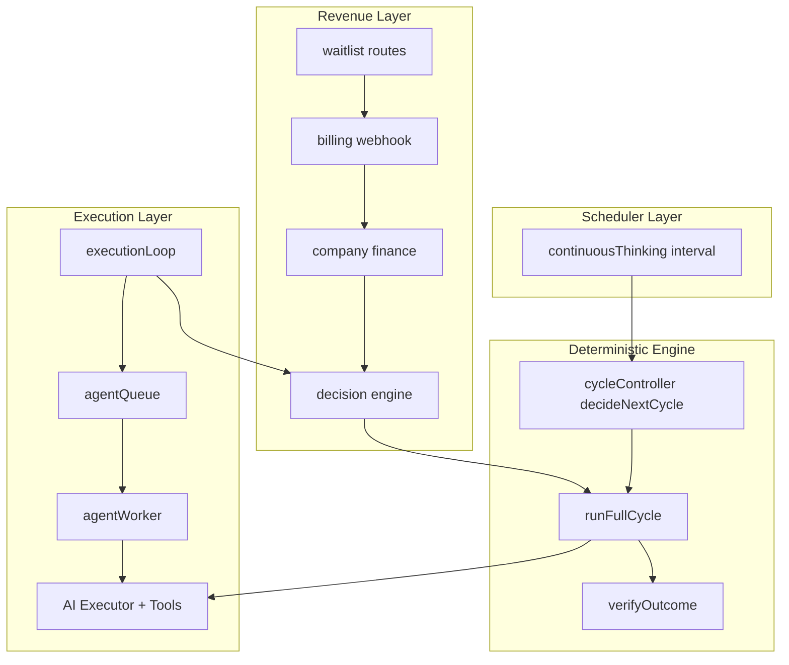

# Hybrid Cycle Architecture

This document defines the runtime architecture for deterministic cycle execution with optimizer-driven iteration.

## 1. Core Runtime Model

```mermaid
flowchart TD
  A[runFullCycle(goal, mode)] --> B[Real-World Side Effects]
  B --> C[Outcome Verification]
  C --> D[Continuous Thinking]
  D --> E[decideNextCycle(metrics)]
  E --> F[runFullCycle(goal, nextMode)]
  F --> B
```

Key property: continuous thinking no longer executes ad-hoc direct actions. It only selects the next deterministic cycle mode.

## 2. Deterministic Full Cycle



Fail-fast rule:
- Any step failure aborts the cycle and returns an exception.
- No queue dependence is used inside runFullCycle.
- No background loops are required to advance steps.

## 3. Mode Selection Logic



## 4. Governance + Reliability Hardening



## 5. Objective Function Gate (RPV)



The decision engine now rejects non-RPV-improving actions before execution.

## 6. Verification Surfaces

Outcome verification now provides deterministic summaries for:
- Landing: visitors, signups, conversionRate, success
- Reddit: posts, replies, upvotes, comments, success
- Email: emailsSent, openRate/clickRate availability, success

## 7. End-to-End Runtime Connection Map


