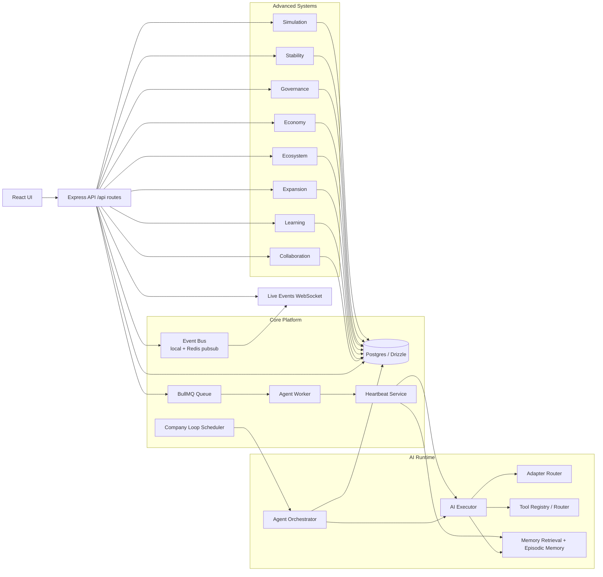
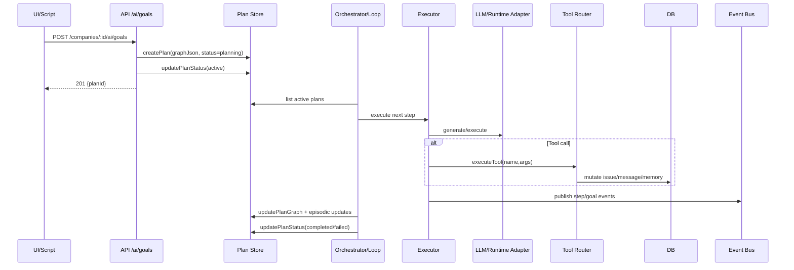
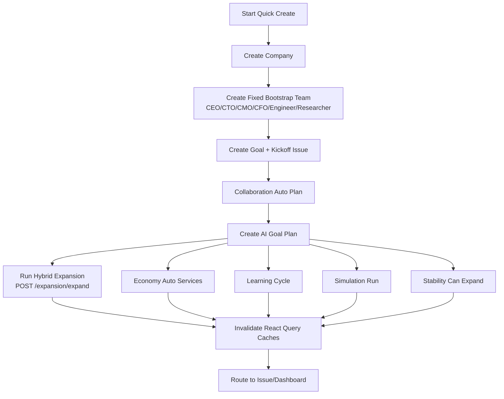

# Live E2E Verification Report (2026-03-19)

This report captures a real run against a live local Paperclip instance at `http://localhost:3100`.

## Environment Snapshot

- API health: `ok`
- Deployment mode: `local_trusted`
- Deployment exposure: `private`
- AI capability detection:
  - `openai: true`
  - `anthropic: false`
  - `mistral: false`
  - `claude_code: true`
  - `codex: true`

## End-to-End Live Checklist

| # | Check | Command/Path | Expected | Result | Notes |
|---|---|---|---|---|---|
| 1 | API reachable | `GET /api/health` | status ok | PASS | health endpoint returned ok |
| 2 | Runtime mode valid for smoke scripts | `health.deploymentMode` | local_trusted | PASS | required by provided smoke scripts |
| 3 | AI capabilities discovered | `GET /api/ai/engines/capabilities` | provider/runtime booleans | PASS | OpenAI true; Anthropic/Mistral false |
| 4 | Acquire-100 scenario script | `node scripts/smoke/acquire-100-users.mjs` | company + issue + goal + artifacts | PARTIAL PASS | artifacts created; AI goal failed due OpenAI quota |
| 5 | Acquire-100 goal execution | `GET /api/companies/:id/ai/goals/:goalId` | completed goal | FAIL | OpenAI 429 insufficient_quota |
| 6 | Full-system scenario script | `node scripts/smoke/micro-saas-50-paying-users.mjs` | collaboration/learning/economy/sim/stability all run | PASS | all subsystem calls returned ok |
| 7 | Full-system AI goal execution | `GET /api/companies/:id/ai/goals/:goalId` | completed goal | FAIL | OpenAI 429 insufficient_quota |
| 8 | Fallback artifact generation | smoke script fallback path | deterministic UI artifacts | PASS | issues/messages/memories/goals visible |
| 9 | Learning module | `POST /api/companies/:id/learning/cycle` | success | PASS | learning cycle executed |
| 10 | Economy module | service register + status | success | PASS | services + status returned |
| 11 | Simulation module | single + montecarlo | success | PASS | both calls returned success |
| 12 | Stability module | assessment + can-expand | success | PASS | both calls returned success |

## Observed Live Run IDs

### Scenario A (Acquire 100 users)
- Company ID: `f0cde462-b4ed-45a3-ba36-a30ef78beca6`
- Issue Prefix: `GRO`
- Core Issue ID: `a5450c0e-69d1-4536-a8c0-d9115dc5e86e`
- Goal Plan ID: `9e6e780e-6411-4796-a06a-7f76f0244ed1`
- Goal status: `failed`
- Failure reason: OpenAI `429 insufficient_quota`

### Scenario B (Micro SaaS 50 paying users)
- Company ID: `de532c5f-e9d0-47ed-b670-1ded3fdd0390`
- Issue Prefix: `AUTAA`
- Core Issue ID: `0f3ca7f2-a578-4add-adff-5964eef5f94f`
- Goal Plan ID: `b95bd48a-2565-4406-a15c-a8bb3e4c3ffe`
- Goal status: `failed`
- Failure reason: OpenAI `429 insufficient_quota`

## Architecture Graphs

## 1) Complete System Architecture (Runtime + Control Plane)



## 2) AI Goal Execution Sequence



## 3) Hybrid Onboarding Flow (Implemented)



## 4) Expansion Pipeline (Research-Driven Agent Creation)

```mermaid
flowchart LR
  X[POST /companies/:id/expansion/expand]
  GV[Governance Clearance + Rate Limit]
  WL[Workforce Limit Check]
  GAP[Capability Gap Analysis]
  DSG[Design Agents from Gaps]
  APR[Submit Expansion Request]
  DEC{Approved?}
  CRT[Create Agent]
  CMP[Complete Expansion]
  OUT[Return results[]]

  X --> GV --> WL --> GAP --> DSG --> APR --> DEC
  DEC -- yes --> CRT --> CMP --> OUT
  DEC -- no --> OUT
```

## Verification Summary

- Platform architecture is operational end-to-end for orchestration, collaboration, learning, economy, simulation, and stability APIs.
- Real OpenAI path is wired but currently blocked in this environment by account quota (`insufficient_quota`).
- Hybrid onboarding implementation is active and non-blocking: fixed bootstrap + research-driven expansion attempt.

## Recommended Next Live Validation

1. Recharge/enable OpenAI billing quota and rerun both smoke scripts.
2. Add Anthropic/Mistral keys, then rerun capability check and route-specific AI goal tests.
3. Add one dedicated script that sets `adapterConfig.aiRuntime` per provider and verifies successful step completion without fallback.
