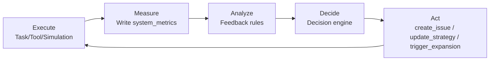
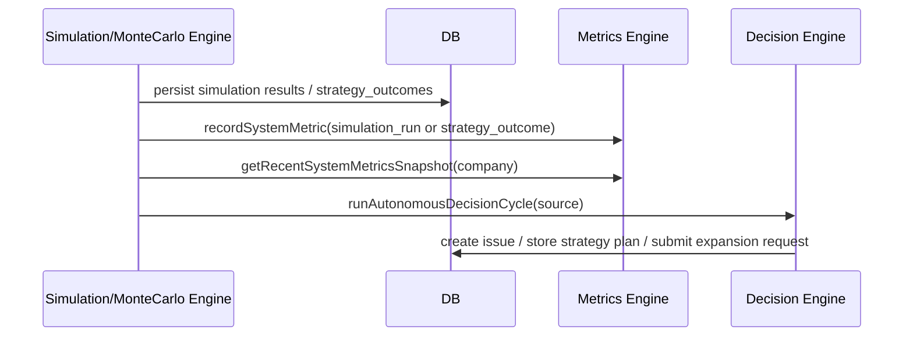
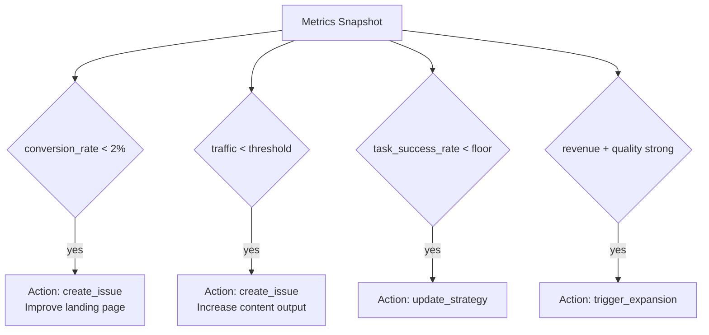

# Real System Behavior (Decision + Feedback Intelligence)

## Why This Layer Exists

Layer 2 turns the platform from "execution-capable" into "self-improving":

1. Execute work.
2. Measure real outcomes.
3. Analyze decision signals.
4. Decide next actions automatically.
5. Execute those actions.

This closes the loop end-to-end.

---

## What Was Implemented

### 1. Metrics Engine (Mandatory Foundation)

A normalized runtime signal table and aggregation engine were added.

#### Data model

- New table: `system_metrics`
- Schema file: `packages/db/src/schema/system_metrics.ts`
- Migration: `packages/db/src/migrations/0028_loud_retro_girl.sql`

Captured signals:

```ts
metrics = {
  traffic: number,
  conversions: number,
  revenue: number,
  task_success_rate: number,
  cost_per_action: number
}
```

#### Engine

- File: `server/src/ai/feedback/metricsEngine.ts`
- Capabilities:
  - `recordSystemMetric(...)`
  - `getRecentSystemMetricsSnapshot(...)`
  - `listRecentSystemMetrics(...)`
  - `estimateTokenCostCents(...)`

---

### 2. Feedback Loop Engine Upgrade (Core Brain)

The economic loop now includes behavior-driven triggers.

- File upgraded: `server/src/ai/governance/economicFeedbackLoop.ts`
- New behavior signal type: `BehaviorMetrics`
- New trigger actions:
  - `improve_landing_page`
  - `increase_content_output`
  - `update_strategy`
  - `trigger_expansion`

Rules now include:

- If conversion rate < 2% → trigger landing page optimization signal.
- If traffic < threshold → trigger content output growth signal.
- If task success rate too low → trigger strategy update signal.
- If revenue + quality are strong → trigger expansion signal.

---

### 3. Auto Decision Engine

A new autonomous decision service now converts feedback into real actions.

- New file: `server/src/ai/governance/decisionEngine.ts`
- Core API:
  - `runAutonomousDecisionCycle(...)`

Decision output action set:

- `create_issue`
- `update_strategy`
- `trigger_expansion`

Execution behavior:

- `create_issue`: creates operational backlog work items.
- `update_strategy`: triggers fresh strategy planning for the company.
- `trigger_expansion`: submits expansion requests from detected capability gaps (with existing governance checks and workforce limits).

Safety controls:

- Cooldown window to prevent repeated action spam.
- Duplicate issue suppression for same title + active statuses.

---

### 4. Loop Closure (Execute → Measure → Analyze → Decide → Execute)

The loop is now wired into all requested control points.

#### Metrics logging hooks

1. After every tool action:
   - File: `server/src/ai/executor.ts`
   - Source type: `tool_action`

2. After every task execution step:
   - File: `server/src/ai/orchestration/companyLoop.ts`
   - Source type: `task_execution`

3. After simulation run completion:
   - File: `server/src/ai/simulation/simulationEngine.ts`
   - Source type: `simulation_run`

4. After strategy outcomes persistence:
   - File: `server/src/ai/simulation/montecarlo/monteCarloEngine.ts`
   - Source type: `strategy_outcome`

#### Decision-cycle execution hooks

1. After core execution loop cycles:
   - File: `server/src/core/executionLoop.ts`
   - Trigger source: `execution_loop`

2. After simulation completion:
   - File: `server/src/ai/simulation/simulationEngine.ts`
   - Trigger source: `simulation_run`

3. After strategy outcomes (Monte Carlo):
   - File: `server/src/ai/simulation/montecarlo/monteCarloEngine.ts`
   - Trigger source: `strategy_outcome`

---

## Control-Loop Architecture



---

## Runtime Sequence: Task + Tool Path

```mermaid
sequenceDiagram
  participant Loop as Execution Loop
  participant Task as Task Step
  participant AI as AI Executor
  participant Metrics as Metrics Engine
  participant Feedback as Feedback Loop
  participant Decision as Decision Engine
  participant Board as Issue/Strategy/Expansion APIs

  Loop->>Task: execute next step
  Task->>AI: executeAI(context)
  AI-->>Task: result (success/failure/tool)
  Task->>Metrics: recordSystemMetric(task_execution)
  AI->>Metrics: recordSystemMetric(tool_action) (when tool called)
  Loop->>Metrics: snapshot = getRecentSystemMetricsSnapshot()
  Loop->>Feedback: runBehaviorFeedback(snapshot)
  Feedback-->>Decision: actions
  Decision->>Board: create_issue / update_strategy / trigger_expansion
```

---

## Runtime Sequence: Simulation + Strategy Outcomes Path



---

## Decision Mapping



---

## Governance Visibility Endpoints Added

In `server/src/routes/governance.ts`:

1. `GET /api/companies/:companyId/governance/system-metrics`
   - Returns aggregated snapshot + recent raw entries.

2. `POST /api/companies/:companyId/governance/decision-cycle`
   - Manually runs a decision cycle using current snapshot.

---

## New Telemetry Events

Added event types in `server/src/events/eventTypes.ts`:

- `metrics.recorded`
- `decision.cycle.completed`
- `decision.action.executed`

---

## Validation Performed

1. Server typecheck passed:
   - `pnpm --filter @paperclipai/server typecheck`

2. DB typecheck passed:
   - `pnpm --filter @paperclipai/db typecheck`

3. New unit tests passed:
   - `pnpm --filter @paperclipai/server exec vitest run src/__tests__/decision-feedback-layer2.test.ts`

---

## How the System Behaves Now

Before:

- Execution and planning existed.
- Learning/feedback signals existed but were not tightly closed into auto-actions.

After:

- Every important runtime event emits measurable decision signals.
- Feedback rules evaluate those signals continuously.
- Decision engine translates signals into concrete actions.
- Actions mutate the system (issues, strategy plans, expansion requests).
- Those mutations feed back into execution and produce the next cycle of measurements.

This is now an autonomous closed-loop control system rather than a one-way orchestrator.
